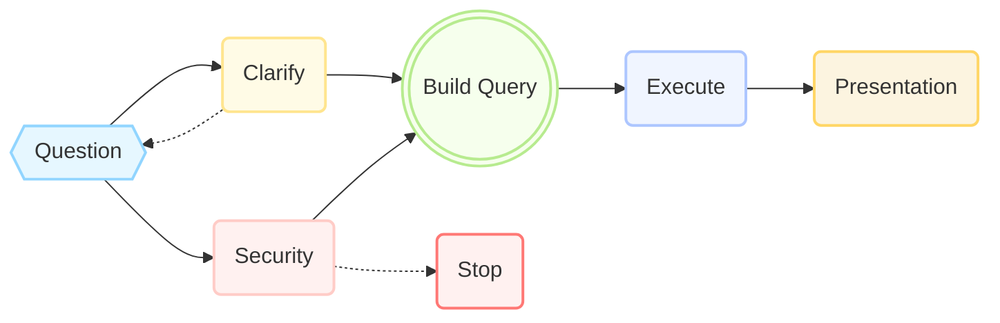
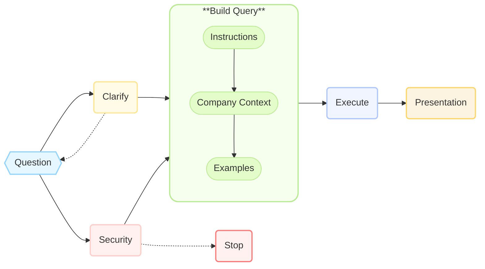
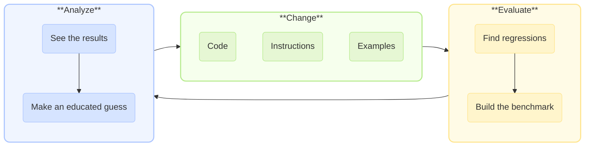

# Text-to-SQL

Building Reliable Solutions with LLMs

<div @click="$slidev.nav.next" class="mt-12 py-1" hover:bg="white op-10">
  Start <carbon:arrow-right />
</div>

<div class="abs-br m-6 text-xl">
  <!-- <button @click="$slidev.nav.openInEditor()" title="Open in Editor" class="slidev-icon-btn">
    <carbon:edit />
  </button> -->
  <a href="https://multinear.com" target="_blank" class="slidev-icon-btn">
    <div style="display: inline-flex; align-items: center; justify-content: center; width: 1.1em; height: 1.1em; border-radius: 50%; background-color: white; vertical-align: middle;">
      <object type="image/svg+xml" data="./assets/logo.svg" style="width: 0.8em; height: 0.8em; display: block; pointer-events: none;"></object>
    </div>
  </a>
  <a href="https://github.com/multinear-demo/demo-windforest-vanilla-py" target="_blank" class="slidev-icon-btn">
    <carbon:logo-github />
  </a>
</div>

<!--
Poll
Have you shipped a Text‑to‑SQL feature?
- Yes, in prod
- Prototype only
- Thinking about it
- No, just curious
-->

---
transition: slide-left
---

# 💡 Meet the Team

<div grid="~ cols-2 gap-4">
<div style="padding-top: 1em">

👤 **Dima Kuchin**

- Co-founder at Multinear  
- Engineering leader
- Passionate about building reliable AI solutions
- Multiple AI projects from POC to production  
- [LinkedIn @kuchin](https://www.linkedin.com/in/kuchin), [X @kuchin](https://x.com/kuchin)

</div>
<div style="padding-top: 1em">

👤 **Asaf Bord**

- Co-founder at Multinear  
- Product leader
- Specializes in AI product strategy
- Numerous AI projects in production
- [LinkedIn @asafbord](https://www.linkedin.com/in/asafbord)

</div>
</div>

<div style="padding-top: 5em; text-align: center">
    ⭐ Combined Experience ⭐<br/>
    Meta, eBay, Zoominfo, WeWork,<br/>
    Northwestern Mutual, Lemonade
</div>

<!-- Quick intro, set expectations for the structure: we'll start with pain, move to guiding principles, and end with concrete war stories. -->

---
transition: slide-up
---

# 🚀 Proof of Concept is Easy

- **Basic instructions**
  ```markdown
  You're a helpful SQL assistant. Answer user question based on the schema below. Generate valid SQL.
  ```

- **Provide schema**  
  ```sql
  CREATE TABLE users (id INT, name VARCHAR(255), email VARCHAR(255));
  CREATE TABLE orders (id INT, user_id INT, total DECIMAL);
  ```

- **Ask question**  

  User: _"List everybody who spent more than $500."_

🎯 **It just works!**

  <div style="display: flex; align-items: baseline; gap: 0.5em; padding-left: 1.2em;">
    <div>AI reply:</div>
    <div>
```sql
SELECT * FROM users WHERE id IN (SELECT user_id FROM orders WHERE total > 500);
```
    </div>
  </div>

<!-- Easy to start with a POC, but what about production? -->

---
transition: slide-up
---

# 🤖 Text-to-SQL top challenges

Something something something

|                                |                                |
| ------------------------------ | ------------------------------ |
| 👻 **Hallucinations**          | Models referencing non-existent tables and columns |
| 🎯 **Query Accuracy**          | Syntactically perfect SQL producing incorrect results |
| 🔄 **Consistency Issues**      | Varying responses to identical questions |
| 🤔 **Question Ambiguity**      | Handling unclear or imprecise user inputs |
| ⏳ **Performance Bottlenecks** | Slow execution times in AI agent operations |
| 🔒 **Security Concerns**       | LLM-based SQL injections |

---
transition: slide-up
---

# 🔀 Multiple Text-to-SQL Use Cases

|                   |                   |                   |
| ----------------- | ----------------- | ----------------- |
|                   | **Business app**  | **Enterprise data‑lake** |
| <span style="color: #00007F">Focus</span> | <span v-mark="{ at: 0, color: 'red', type: 'underline' }">Reliability</span> over coverage | <span v-mark="{ at: 0, color: 'green', type: 'underline' }">Coverage & speed</span> over accuracy |
| <span style="color: #00007F">Typical User</span> | Business user | Data analyst, developer, PM |
| <span style="color: #00007F">Tables</span>      | 10‑50          | 1000+              |
| <span style="color: #00007F">Accuracy</span>    | 95 %+ required | 70‑80 % acceptable |
| <span style="color: #00007F">Consistency</span>    | Very important | Not so important |

<div style="padding-top: 3em; text-align: center;">
    <b>More Use Cases</b>: 🔸 Client-facing app 🔸 Internal business logic
</div>

<!-- Clarify that "Text‑to‑SQL" is not a single use‑case; sets up later trade‑offs. -->

---
transition: slide-up
---

# 📊 Business App Text-to-SQL

**Role**: A business analyst replacement.

**Goal**: Reliability. 

A combination of:

- 🎯 **Accuracy**: Correct results
- 🔄 **Consistency**: Same results every time—column names, joins, aggregations, etc.
- 📚 **Domain Knowledge**: Understand company jargon (e.g., ERP, CRM terminology)
- 🤔 **Ambiguity Handling**: Clarify unclear requests—prevent "garbage in, garbage out"
- 📊 **Presentation**: Choose between tables and charts, picking the best visualization method
- 🔒 **Guardrails**: Enforce access control, prevent prompt injection

<div style="padding-top: 2em; text-align: center;">
    ⭐ Ensuring analyst-level trust & quality ⭐
</div>

<!-- Highlights critical reliability components essential for business users relying on Text-to-SQL in production scenarios. -->

---
transition: fade-out
---

# Make LLM think less, not more

Decompose the solution into smaller steps.



---
transition: slide-up
---

# Make LLM think less, not more

Decompose query builder.



---
transition: slide-up
---

# 🔄 Consistency


---
transition: slide-up
---

# 🔍 Eval-driven development
Iterative process

.



---
transition: slide-up
---

# Observations
Across multiple projects

<div style="padding-top: 0.5em">

🔹 **Large context windows** are not helping much

<div style="padding-left: 1.3em; font-style: italic;">
    More information = more noise, requires more thinking = more mistakes
</div>

🔹 **Fine-tuning** helps a little, but requires a lot of time and resources

<div style="padding-left: 1.3em; font-style: italic;">
    Models already know SQL, teaching them new knowledge is hard
</div>

🔹 <span v-mark="{ at: 0, color: 'red', type: 'underline' }">Critical</span>: **Fast Experimentation**

<div style="padding-left: 1.3em; font-style: italic;">
    Fast feedback loop allows rapid development
</div>

🔹 <span v-mark="{ at: 0, color: 'red', type: 'underline' }">Critical</span>: **Evaluations**

<div style="padding-left: 1.3em; font-style: italic;">
    Evaluations are the only way to know if the solution is doing what it's supposed to
</div>

</div>

---

# How to Make Evals

<!-- - Mock data lets you know the *answer* ahead of time
- Benchmarks catch regressions in minutes, not days
- Enables safe model swaps (OpenAI ↔︎ Gemini ↔︎ DeepSeek) -->

---

# Multinear Platform

---

# Demo (5 min)

<!-- 1. Ambiguity check ➜ follow‑up
2. Mini‑RAG example retrieval
3. SQL generation & execution
4. Eval score prints green

*(recorded GIF plays automatically)* -->

---

# Takeaways

1. Pinpoint *your* success criteria first
<!-- 2. Use Mini‑RAG – fewer, better examples
3. Split tasks so the model thinks less
4. Invest in evals early; they pay daily
5. Model swap is easy *after* #4 -->

---

## What's next?

- Grab the starter kit ➜ ...
- Register for the deep‑dive workshop
- Connect with us on LinkedIn / X

Thanks!
