# Text-to-SQL

Building Reliable Solutions with LLMs

<div @click="$slidev.nav.next" class="mt-12 py-1" hover:bg="white op-10">
  Start <carbon:arrow-right />
</div>

<div class="abs-br m-6 text-xl">
  <!-- <button @click="$slidev.nav.openInEditor()" title="Open in Editor" class="slidev-icon-btn">
    <carbon:edit />
  </button> -->
  <a href="https://multinear.com" target="_blank" class="slidev-icon-btn">
    <div style="display: inline-flex; align-items: center; justify-content: center; width: 1.1em; height: 1.1em; border-radius: 50%; background-color: white; vertical-align: middle;">
      </img>
    </div>
  </a>
  <a href="https://github.com/multinear-demo/demo-windforest-vanilla-py" target="_blank" class="slidev-icon-btn">
    <carbon:logo-github />
  </a>
</div>

<!--
Poll
Have you shipped a Text‑to‑SQL feature?
- Yes, in prod
- Prototype only
- Thinking about it
- No, just curious
-->

---
transition: slide-left
---

# 💡 Meet the Team

<div grid="~ cols-2 gap-4">
<div style="padding-top: 2em">

👤 **Dima Kuchin**

- Co-founder at Multinear </img>
- Engineering leader
- Passionate about building reliable AI solutions
- Multiple AI projects from POC to production  
- [LinkedIn @kuchin](https://www.linkedin.com/in/kuchin), [X @kuchin](https://x.com/kuchin)

</div>
<div style="padding-top: 2em">

👤 **Asaf Bord**

- Co-founder at Multinear </img>
- Product leader
- Specializes in AI product strategy
- Numerous AI projects in production
- [LinkedIn @asafbord](https://www.linkedin.com/in/asafbord)

</div>
</div>

<div style="padding-top: 5em; text-align: center">
    ⭐ Combined Experience ⭐<br/>
    Meta, eBay, Zoominfo, WeWork,<br/>
    Northwestern Mutual, Lemonade
</div>

<!-- Quick intro, set expectations for the structure: we'll start with pain, move to guiding principles, and end with concrete war stories. -->

---
transition: slide-up
---

# 🚀 Proof of Concept is Easy

- **Basic instructions**
  ```markdown
  You're a helpful SQL assistant. Answer user question based on the schema below. Generate valid SQL.
  ```

- **Provide schema**  
  ```sql
  CREATE TABLE users (id INT, name VARCHAR(255), email VARCHAR(255));
  CREATE TABLE orders (id INT, user_id INT, total DECIMAL);
  ```

- **Ask question**  

  User: _"List everybody who spent more than $500."_

🎯 **It just works!**

  <div style="display: flex; align-items: baseline; gap: 0.5em; padding-left: 1.2em;">
    <div>AI reply:</div>
    <div>
```sql
SELECT * FROM users WHERE id IN (SELECT user_id FROM orders WHERE total > 500);
```
    </div>
  </div>

<!-- Easy to start with a POC, but what about production? -->

---
transition: slide-up
---

# 🤖 Text-to-SQL top challenges

Most common issues

|                                |                                |
| ------------------------------ | ------------------------------ |
| 👻 **Hallucinations**          | Models referencing non-existent tables and columns |
| 🎯 **Query Accuracy**          | Syntactically perfect SQL producing incorrect results |
| 🔄 **Consistency Issues**      | Varying responses to identical questions |
| 🤔 **Question Ambiguity**      | Handling unclear or imprecise user inputs |
| ⏳ **Performance Bottlenecks** | Slow execution times in AI agent operations |
| 🔒 **Security Concerns**       | LLM-based SQL injections |

---
transition: slide-up
---

# 🔀 Multiple Text-to-SQL Use Cases

|                   |                   |                   |
| ----------------- | ----------------- | ----------------- |
|                   | **Business app**  | **Enterprise data‑lake** |
| <span style="color: #00007F">Success Criteria</span> | <span v-mark="{ at: 1, color: 'red', type: 'underline' }">Reliability</span> over coverage | <span v-mark="{ at: 1, color: 'green', type: 'underline' }">Coverage & speed</span> over accuracy |
| <span style="color: #00007F">Typical User</span> | Business user | Data analyst, developer, PM |
| <span style="color: #00007F">Tables</span>      | 10‑50          | 1000+              |
| <span style="color: #00007F">Accuracy</span>    | <span v-mark="{ at: 1, color: 'red', type: 'circle' }">95 %+</span> required | 70‑80 % acceptable |
| <span style="color: #00007F">Consistency</span>    | <span v-mark="{ at: 1, color: 'red', type: 'underline' }">Very important</span> | Not so important for data exploration |

<div style="padding-top: 3em; text-align: center;">
    <b>More Use Cases</b>: 🔸 Client-facing app 🔸 Internal business logic
</div>

<!-- Clarify that "Text‑to‑SQL" is not a single use‑case; sets up later trade‑offs. -->

---
transition: slide-up
---

# 📊 Business App Text-to-SQL

## Role: A business analyst replacement

**Primary Goal**: Reliability

<div style="padding-top: 0.1em;">

A combination of:

- 🎯 **Accuracy**: Correct results
- 🔄 **Consistency**: Same results every time—column names, joins, aggregations, etc.
- 📚 **Domain Knowledge**: Understand company jargon (e.g., ERP, CRM terminology)
- 🤔 **Ambiguity Handling**: Clarify unclear requests—prevent "garbage in, garbage out"
- 📊 **Presentation**: Choose between tables and charts, picking the best visualization method
- 🔒 **Guardrails**: Enforce access control, prevent prompt injection

</div>

<div style="padding-top: 2em; text-align: center;">
    ⭐ Ensuring analyst-level trust & quality ⭐
</div>

<!-- Highlights critical reliability components essential for business users relying on Text-to-SQL in production scenarios. -->

---
transition: fade-out
---

# Make LLM think less, not more

Decompose the solution into smaller steps

<br><br>


---
transition: slide-up
---

# Make LLM think less, not more

Decompose query builder

```mermaid {scale: 0.8}
flowchart LR
  style A fill:#E6F7FF,stroke:#91D5FF,stroke-width:2px
  style B1 fill:#FFFBE6,stroke:#FFE58F,stroke-width:2px
  style B2 fill:#FFF1F0,stroke:#FFCCC7,stroke-width:2px
  style C fill:#F6FFED,stroke:#B7EB8F,stroke-width:2px,rx:15,ry:15
  style C1 fill:#E4FBCA,stroke:#B7EB8F,stroke-width:1px
  style C2 fill:#E4FBCA,stroke:#B7EB8F,stroke-width:1px
  style C3 fill:#E4FBCA,stroke:#B7EB8F,stroke-width:1px
  style D fill:#F0F5FF,stroke:#ADC6FF,stroke-width:2px
  style E fill:#FCF4E0,stroke:#FFD666,stroke-width:2px
  style F fill:#FFF1F0,stroke:#FF7875,stroke-width:2px

  A{{Question}} --> B1(Clarify);
  A{{Question}} --> B2(Security);

  subgraph C [**Build Query**]
    direction TB
    C1([Instructions]) --> C2([Company Context]);
    C2 --> C3([Examples]);
  end

  B1 --> C;
  B2 --> C;
  B2 -- "&nbsp;Alert ⚠️&nbsp;" --> F(((Stop)));
  C --> D(Execute);
  D --> E(Presentation);
  B1 -.-> A;
```



---
transition: slide-up
---

# 🤖 AI Agents
##

<br>

**Agents are easy**

- Work better
- But not as reliable
- Slow and hard to improve

```mermaid {scale: 0.85}
graph TB
  style GQ fill:#E6F7FF,stroke:#91D5FF,stroke-width:2px,rx:10,ry:10
  style GS fill:#FFFBE6,stroke:#FFE58F,stroke-width:2px,rx:10,ry:10
  style ES fill:#F0F5FF,stroke:#ADC6FF,stroke-width:2px,rx:10,ry:10
  style AR fill:#F6FFED,stroke:#B7EB8F,stroke-width:2px,rx:10,ry:10
  style IM fill:#FCF4E0,stroke:#FFD666,stroke-width:2px,rx:10,ry:10
  style Stop fill:#F6FFED,stroke:#B7EB8F,stroke-width:2px,rx:10,ry:10

  GQ{{Question}} --> Loop;

  subgraph Loop [Agent Loop]
    direction LR
    GS(Generate SQL) --> ES([Execute SQL]);
    ES --> AR([Analyze Results]);
    AR -- "&nbsp;Unhappy 🚫&nbsp;" --> IM([Improve]);
    IM --> GS;
  end

  AR -- "&nbsp;Good ✅&nbsp;" --> Stop(((Done)));
```

<div style="text-align: center; margin-top: -11em"> 



</div>

---
transition: slide-up
---

# 🔄 Inconsistency: Same Q, Different Answers
##

<div style="font-size: 0.8em; padding-top: 1em;">
User Question: <b>"Last year sales, by quarter"</b>
</div>

<br>

<div grid="~ cols-3 gap-6" style="font-size: 0.7em;">

<div>

**Variant A**

```sql
SELECT 
  EXTRACT(QUARTER FROM order_date) AS quarter, 
  SUM(total) AS sales
FROM orders
WHERE EXTRACT(YEAR FROM order_date) = 2023
GROUP BY quarter;
```

<br>

| quarter | sales  |
|---------|--------|
| 1       | 12,500 |
| 2       | 10,400 |

</div>

<div>

**Variant B**

```sql
SELECT 
  CONCAT('Q', EXTRACT(QUARTER FROM order_date)) AS Quarter, 
  ROUND(SUM(total), 0) AS TotalSales
FROM orders
WHERE YEAR(order_date) = YEAR(CURDATE()) - 1
GROUP BY Quarter;
```

<br>

| <span v-mark="{ at: 1, color: 'red', type: 'underline' }">Quarter</span> | <span v-mark="{ at: 1, color: 'red', type: 'underline' }">TotalSales</span> |
|---------|------------|
| <span v-mark="{ at: 1, color: 'red', type: 'underline' }">Q1</span>      | 12,500     |
| <span v-mark="{ at: 1, color: 'red', type: 'underline' }">Q2</span>      | 10,400     |

</div>

<div>


**Variant C**

```sql
SELECT 
  CONCAT(EXTRACT(YEAR FROM order_date), '-Q', EXTRACT(QUARTER FROM order_date)) AS period, 
  FORMAT(SUM(total), 2) AS total_amount
FROM orders
WHERE order_date BETWEEN '2023-01-01' AND '2023-12-31'
GROUP BY period;
```

<br>

| <span v-mark="{ at: 1, color: 'orange', type: 'underline' }">period</span>   | <span v-mark="{ at: 1, color: 'orange', type: 'underline' }">total_amount</span> |
|----------|--------------|
| <span v-mark="{ at: 1, color: 'orange', type: 'underline' }">2023-Q1</span>  | <span v-mark="{ at: 1, color: 'orange', type: 'underline' }">12,500.00</span>    |
| <span v-mark="{ at: 1, color: 'orange', type: 'underline' }">2023-Q2</span>  | <span v-mark="{ at: 1, color: 'orange', type: 'underline' }">10,400.00</span>    |

</div>

</div>

<style>
    pre {
        font-size: 0.7em !important;
    }
</style>

---
transition: slide-up
---

# 🎯 Accuracy: Same Q, Wrong Results
##

<div style="font-size: 0.8em; margin-bottom: 1em; padding-top: 1em;">
User Question: <b>What's our sales total for March 2024?</b>

<div grid="~ cols-2 gap-4" style="font-size: 0.9em; padding-top: 2em;">

<div>

**Variant A** 

- Gross sales
- Invoice date

<br>

```sql
SELECT SUM(total_amount) AS march_sales
FROM invoices
WHERE invoice_date BETWEEN '2024-03-01'
  AND '2024-03-31';
```

**Result:**

```md
**march_sales**: $125,000
```

</div>

<div>

**Variant B** 

- Net sales
- Payment date

<br>

```sql
SELECT SUM(total_amount - returns - discounts) AS total_sales
FROM invoices
WHERE payment_date >= '2024-03-01' -- Uses actual payment date
  AND payment_date < '2024-03-31'; -- Doesn't include 31st
```

**Result:**

```md
**total_sales**: $89,500
```

</div>

</div>

</div>

<style>
    pre {
        font-size: 0.75em !important;
        margin-top: 0.5em;
    }
</style>

---
transition: slide-up
---

# 👀 Observations
Across multiple projects

<div style="font-size: 0.9em; margin-top: 2em;">

🔹 **Large context windows** are not helping much

<div style="padding-left: 1.3em; margin-top: -0.5em; font-style: italic;">
    More information = more noise, requires more thinking = more mistakes
</div>

🔹 **Fine-tuning** helps a little, but requires a lot of time and resources

<div style="padding-left: 1.3em; margin-top: -0.5em; font-style: italic;">
    Models already know SQL, teaching them new knowledge is hard
</div>

🔹 <span v-mark="{ at: 1, color: 'green', type: 'underline' }">**Best approach**</span>: a combination of instructions and examples

<div style="padding-left: 1.3em; margin-top: -0.5em; font-style: italic;">
    Instructions are the <b>what</b>, examples are the <b>how</b>
</div>

🔹 <span v-mark="{ at: 1, color: 'red', type: 'underline' }">Critical</span>: **Fast Experimentation**

<div style="padding-left: 1.3em; margin-top: -0.5em; font-style: italic;">
    Fast feedback loop allows rapid development
</div>

🔹 <span v-mark="{ at: 1, color: 'red', type: 'underline' }">Critical</span>: **Evaluations**

<div style="padding-left: 1.3em; margin-top: -0.5em; font-style: italic;">
    Evaluations are the only way to know if the solution is doing what it's supposed to
</div>

</div>

---
transition: slide-up
---

# 🧩 Examples

<div grid="~ cols-2 gap-4" style="font-size: 0.7em; line-height: 1.3;">

<div>

- **Q:** _"List all products with inventory below their reorder point."_  <span style="color: gray;">(Inventory)</span>

```sql
SELECT product_id, product_name, current_stock, reorder_point
FROM products
WHERE current_stock < reorder_point
ORDER BY current_stock ASC;
```
<br>

- **Q:** _"What was total sales revenue by sales rep last quarter?"_  <span style="color: gray;">(Sales Reporting)</span>

```sql
SELECT sales_rep_id, sales_rep_name, SUM(order_total) AS total_revenue
FROM sales_orders
WHERE order_date BETWEEN '2024-01-01' AND '2024-03-31'
GROUP BY sales_rep_id, sales_rep_name
ORDER BY total_revenue DESC;
```

<br>

- **Q:** _"All customers who haven't placed an order in the last 6 months."_  <span style="color: gray;">(Customer Segmentation)</span>

```sql
SELECT customer_id, customer_name, last_order_date
FROM customers
WHERE last_order_date < CURRENT_DATE - INTERVAL '6 months'
ORDER BY last_order_date ASC;
```

</div>

<div>

- **Q:** _"Which invoices are overdue by more than 30 days?"_  <span style="color: gray;">(Accounts Receivable)</span>

```sql
SELECT invoice_id, customer_id, invoice_date, due_date, total_amount
FROM invoices
WHERE payment_status = 'Unpaid'
  AND due_date < CURRENT_DATE - INTERVAL '30 days'
ORDER BY due_date ASC;
```

<br>

- **Q:** _"Show me all open POs awaiting vendor delivery."_  <span style="color: gray;">(Procurement)</span>

```sql
SELECT purchase_order_id, vendor_name, order_date, expected_delivery_date
FROM purchase_orders
WHERE status = 'Open'
ORDER BY expected_delivery_date ASC;
```

<br>

- **Q:** _"Highest profit margin categories last year?"_  <span style="color: gray;">(Profitability Analysis)</span>

```sql
SELECT category_id, category_name, SUM(revenue - cost) / SUM(revenue) AS profit_margin
FROM product_sales
WHERE sale_date BETWEEN '2023-01-01' AND '2023-12-31'
GROUP BY category_id, category_name
ORDER BY profit_margin DESC;
```

</div>

</div>

<style>
pre {
  font-size: 0.7em !important; /* Smaller font for examples */
  margin-top: 0.3em;
  line-height: 1.2;
}
.slidev-page > div > div h3 {
    margin-bottom: 0.2em;
}
.slidev-page > div > div ul {
    margin-top: 0.2em;
}
</style>

---
transition: slide-up
---

# ⚒️ How to Make Examples

## TBD

---
transition: slide-up
---

# 🔎 Eval-driven development
##

<br>

- Experimentation: this is the way
- Iterative process

<br>


---
transition: slide-up
---

# ⚙️ Development Workflow
##

<br>

- Start with a goal
- Reverse engineer evals
- Experiment iterations
- Benchmark at the end


<!-- Describes the overall development lifecycle -->

---
transition: fade-out
---

# ⚖️ How to Evaluate

<div style="display: grid; grid-template-columns: 1fr 2fr; gap: 1em; padding-top: 1em;">

<div>

#### Naive Approach

<div style="font-size: 0.8em; padding-top: 1em;">

<br>

- Normalize both queries
- Compare strings

</div>

</div>

<div>

#### LLM-as-a-judge

<div style="font-size: 0.8em; padding-top: 1em;">

**LLM Prompt:**

```markdown
Given the following
Database schema:     <DB_SCHEMA>
User question:       <USER_QUESTION>
Expected SQL query:  <EXPECTED_SQL>
Generated SQL query: <GENERATED_SQL>

Do the "Generated SQL query" and the "Expected SQL query" produce
the same results for the given user question and DB schema?
```

**Expected Output:**

- **Answer:** True / False
- **Reasoning:** Brief explanation comparing the queries

</div>
</div>
</div>

<style>
    pre {
        font-size: 0.8em !important;
    }
</style>

---

# ⚖️ How to Evaluate

<br>

### Query mock DB

<br>

- Generate mock database that matches the production schema
- Fill it with realistic synthetic data <span style="color: gray;">(or anonymize production data)</span>
- Run Text-to-SQL on the user question, get new SQL query
- Run both expected SQL and generated SQL at the mock DB
- Compare results ✅

---

# ⚒️ How to Make Mock Database

## TBD

https://github.com/multinear-demo/demo-windforest-vanilla-py

---

# Multinear Platform

## TBD

https://github.com/multinear/multinear

---

# Takeaways

<br>

1. ⭐ Pinpoint *your* success criteria first
2. 🤔 Make LLM think less, not more
3. 🔎 Reverse engineer examples and evals
4. 📈 Experiment, iterate, benchmark
5. 🚀 Production with confidence

<style>
    div {
        font-size: 1.2em;
    }

    li {
        line-height: 2.5;
    }
</style>

---

# 📚 Resources

<br>

- [Multinear Site](https://multinear.com)
- [Multinear Platform](https://github.com/multinear/multinear)
- [Uber Text-to-SQL](https://www.uber.com/en-GB/blog/query-gpt/)
- [LinkedIn Text-to-SQL](https://www.linkedin.com/blog/engineering/ai/practical-text-to-sql-for-data-analytics)
- [Eugene Yan on evals](https://eugeneyan.com/tag/eval/)
- [Hamel Husain on evals](https://hamel.dev)
- [Lenny Rachitsky episode on evals](https://x.com/lennysan/status/1909636749103599729)


<style>
    li {
        line-height: 2;
    }
</style>

---
layout: cover
background: ./assets/thanks.jpg
---

<div style="text-align: center; text-shadow: 2px 2px 4px #000;">

<br>

## Thanks!

<br>

🔸 Register for deep-dive workshop

🔸 Follow us on LinkedIn and X

🔸 Subscribe to the newsletter

<br>

🔸 Use Multinear

</img>

</div>
